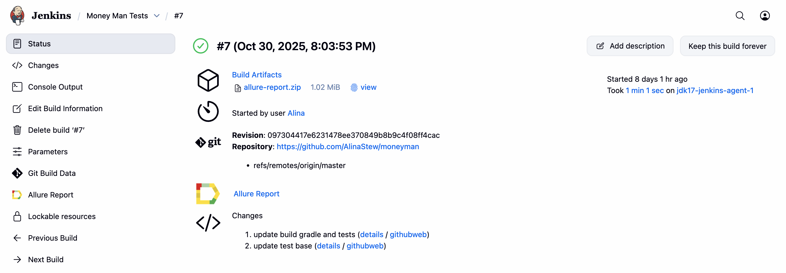
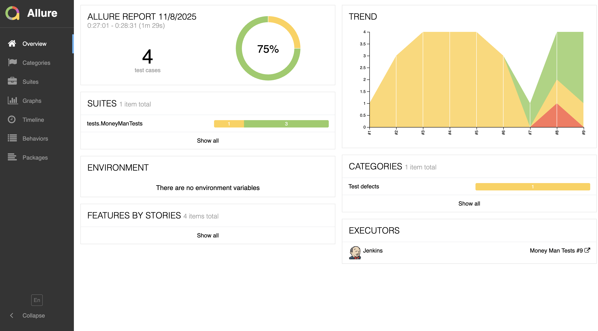
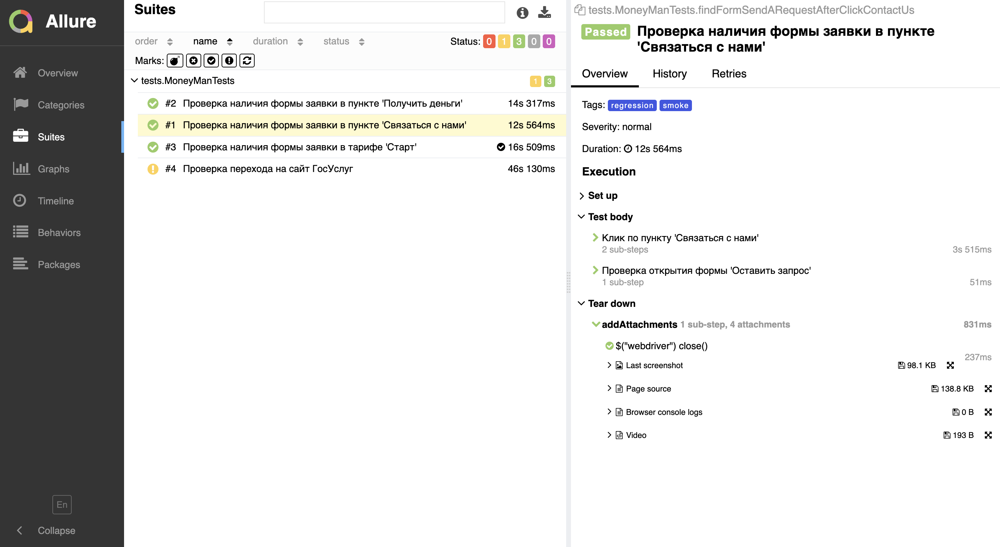
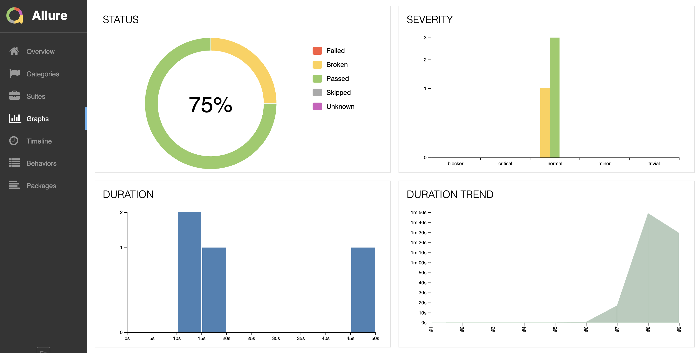
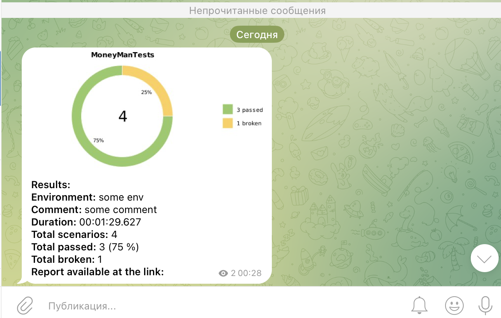
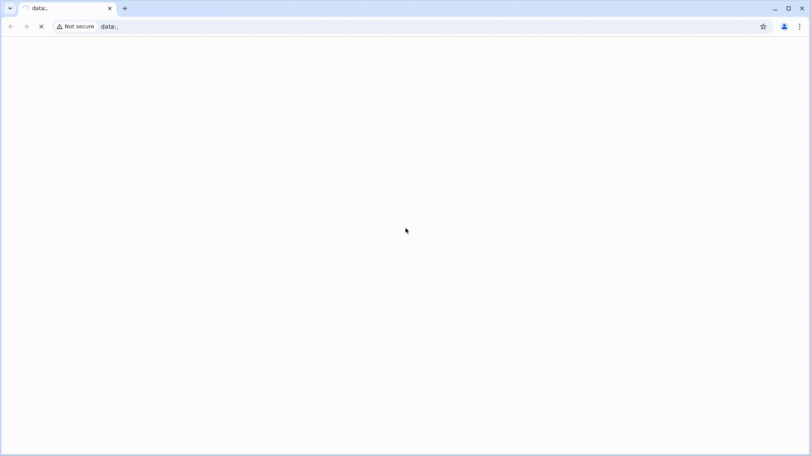
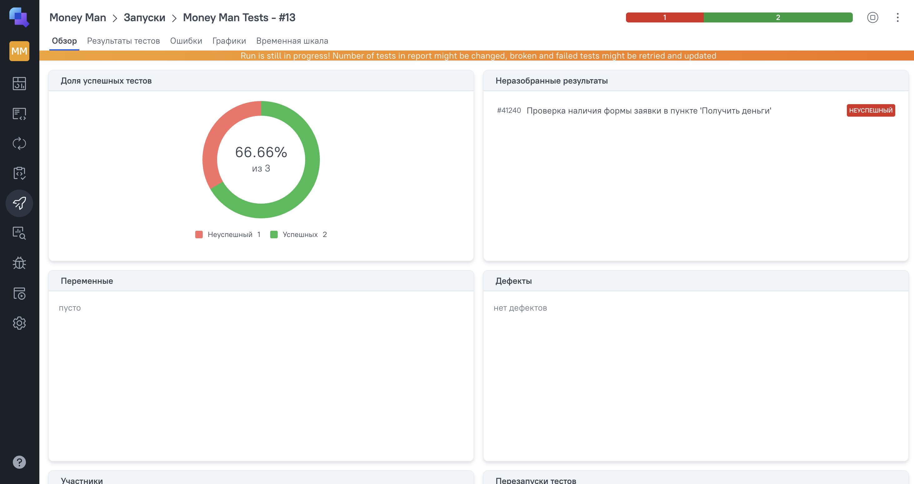
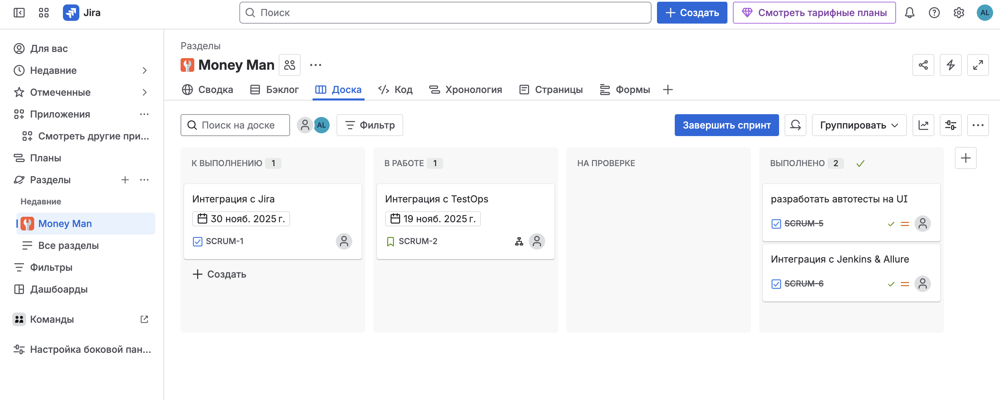

# Проект по автоматизации тестирования для компании [MoneyMan](https://moneyman.ru/)

> MoneyMan («Манимен») — российский онлайн-сервис, который специализируется на выдаче микрозаймов физическим лицам. На сегодняшний день это один из ведущих сервисов в сфере микрофинансов и альтернативного кредитования. Moneyman первым в России стал полностью работать онлайн — от приема заявки до выдачи средств.
Источник: Все о микрофинансовой компании MoneyMan - сервис онлайн займов!


## **Содержание:**

* <a href="#tools">Технологии и инструменты</a>

* <a href="#cases">Тестовые сценарии</a>

* <a href="#jenkins">Сборка в Jenkins</a>

* <a href="#console">Запуск из терминала</a>

* <a href="#allure">Allure отчет</a>

* <a href="#telegram">Уведомление ботом в Telegram о сборке</a>

* <a href="#video">Видео выполнения теста в Selenoid</a>

* <a href="#testops">Интеграция с Allure TestOps</a>

* <a href="#jira">Интеграция с Jira</a>


<a id="tools"></a>
## <a name="Технологии и инструменты">**Технологии и инструменты:**</a>

<p align="center">  
<a href="https://www.jetbrains.com/idea/"></a>  
<a href="https://www.java.com/"></a>  
<a href="https://github.com/"></a>  
<a href="https://junit.org/junit5/"></a>  
<a href="https://gradle.org/"></a>  
<a href="https://selenide.org/"></a>  
<a href="https://aerokube.com/selenoid/"></a>  
<a href="https://github.com/allure-framework/allure2"></a> 
<a href="https://qameta.io/"></a> 
<a href="https://www.jenkins.io/"></a> 
<a href="https://web.telegram.org/"></a>  
<a href="https://www.atlassian.com/ru/software/jira/"></a>  

</p>

- **IntelliJ IDEA**: Среда разработки для написания кода.
- **Java**: Основной язык программирования проекта.
- **GitHub**: Платформа для хостинга и совместной разработки кода.
- **JUnit 5**: Фреймворк для написания и выполнения тестов.
- **Gradle**: Система сборки проектов.
- **Selenide**: Библиотека для написания UI тестов.
- **Selenoid**: Инструмент для управления браузерами в контейнерах.
- **Allure**: Фреймворк для генерации отчетов о тестировании.
- **Jenkins**: Инструмент для автоматизации сборки и CI/CD.
- **Telegram**: Мессенджер для уведомлений о сборке проекта.
- **Jira**: Платформа для управления проектами и отслеживания задач.
- **Allure TestOps**: Платформа для управления тестированием и анализа результатов тестов.


<a id="cases"></a>
## <a name="Тестовые сценарии">**Тестовые сценарии:**</a>

-  Проверка ввода невалидных данных в форме регистрации
-  Проверка перехода на сайт ГосУслуг
-  Проверка наличия формы заявки в пункте 'Связаться с нами'
-  Проверка наличия формы заявки в пункте 'Получить деньги'
-  Проверка наличия формы заявки в тарифе 'Старт'


<a id="jenkins"></a>
## </a><a name="Сборка"></a>Сборка в [Jenkins](https://jenkins.autotests.cloud/job/Kod3ik_qa_guru_x5/)</a>
Jenkins используется для автоматизации сборки и тестирования проекта. Он позволяет любому члену команды запускать тесты в любое время.
<p align="center">  
<a href="https://jenkins.autotests.cloud/job/Money%20Man%20Tests/"></a>  
</p>


### **Параметры сборки в Jenkins:**

- browser – браузер, по умолчанию chrome
- browserVersion – версия браузера, по умолчанию 128
- browserSize – размер окна браузера, по умолчанию 1920x1080
- remoteUrl – логин, пароль и адрес удаленного сервера Selenoid

<a id="console"></a>
## Команды для запуска из терминала

***Локальный запуск:***
```bash  
gradle clean regression -DbrowserSize="1920х1080" -Dbrowser="chrome" -DbrowserVersion="128"

```

***Удаленный запуск в Jenkins:***
```bash  
clean
${TASK}
-Dbrowser=${BROWSER}
-DbrowserVersion=${BROWSER_VERSION}
-DwindowSize=${WINDOWSIZE}
-DremoteUrl=${REMOTE_URL}
```

<a id="allure"></a>
## </a> <a name="Allure"></a>Allure [отчет](https://jenkins.autotests.cloud/job/C28-twentyny-alfabank-ui/allure/)</a>

Allure используется для генерации подробных отчетов о тестировании. Он предоставляет информацию о результатах тестов, включая графики и диаграммы, что помогает анализировать качество продукта и выявлять проблемные области.
### Главная страница

<p align="center">  
  
</p>

### Пример теста

  <p align="center">  

</p>

### Графики

  <p align="center">  

</p>


<a id="telegram"></a>
## </a> Уведомление ботом в Telegram о сборке
Настроены уведомления в Telegram для получения информации о статусе сборки и тестирования.

<p align="center">  
  
</p>


<a id="video"></a>
## </a> Видеозаписи выполнения тестов в Selenoid
Помогают визуально проверять, как проходят тесты и выявлять проблемы.

<p align="center">
   
</p>

<a id="testops"></a>
## </a> Интеграция с [Allure TestOps](https://allure.autotests.cloud/project/4356/test-cases?treeId=0)
Allure TestOps — это платформа для централизованного управления тестами, автоматизации тестирования и анализа результатов. Она поддерживает различные CI/CD инструменты и тестовые фреймворки, предоставляя подробные отчеты и аналитику.

### Allure TestOps Обзор

<p align="center">  
  
</p>


<a id="jira"></a>
## </a> Интеграция с [Jira](https://livanovaaaliv.atlassian.net/jira/software/projects/SCRUM/boards/1)
Jira — это инструмент для управления проектами и задачами, который помогает командам планировать, отслеживать и выпускать ПО. Интеграция с Jira позволяет централизованно управлять задачами, автоматизировать процессы и улучшать командное взаимодействие, поддерживая методологии Agile и Scrum и предоставляя мощные функции отчетности и анализа.

<p align="center">  
  
</p>